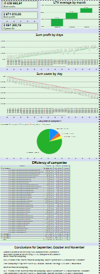

# 🌍 Company Profits by Country — Power BI Dashboard

This Power BI project presents a visual analysis of company profits segmented by country.  
It provides an overview of how profits are distributed across different regions and industries.

## 📁 Files Included

- `Profits of companies from countries.pbix` — Power BI file containing the dashboard and data model

## 📊 Dashboard Highlights

The dashboard includes:

- Total profit by country
- Company-level profit breakdown
- Interactive map visualizing global profit distribution
- Filters by region, industry, or company name (if available)
- Key performance indicators (KPIs): total profit, average profit per company, and more

## 🎯 Objective

This dashboard helps answer questions such as:

- Which countries generate the highest profits?
- How do companies in different regions compare?
- Are there visible trends by geography or category?

The project is suitable for portfolio use or as a base for deeper financial analytics.

## 🛠️ Tools Used

- Power BI Desktop
- DAX (for calculated measures)
- Sample or real-world profit data (CSV/Excel as source)

## 📷 Dashboard Preview

---

Feel free to fork, clone, or leave feedback. Thanks for visiting!
